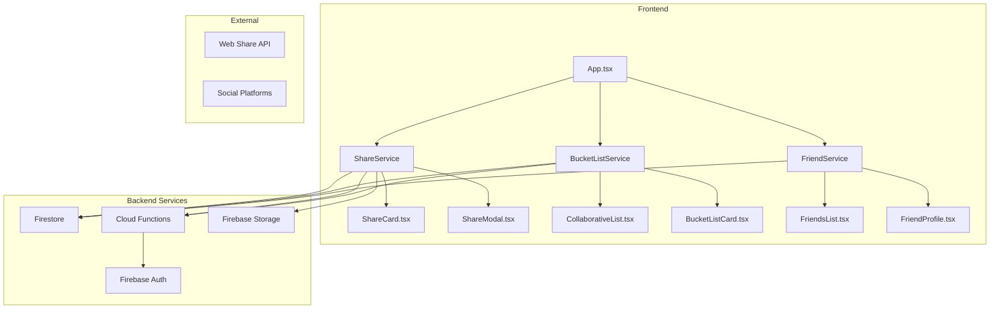

# Trip Sharing & Collaborative Bucket Lists - Feature Design

## 1. Executive Summary

This document outlines the design for implementing **trip sharing** and **collaborative bucket lists** in Wanderlog. These features will enable users to:
- Share their travel experiences with friends and the community
- Collaborate on shared bucket lists with trip companions
- View friends' travel stats and discoveries
- Generate shareable travel summaries

---

## 2. Feature Overview

### 2.1 Trip Sharing

| Feature | Description | Priority |
|---------|-------------|----------|
| **Shareable Trip Cards** | Generate visual cards summarizing a trip | P0 |
| **Public Profile** | Optional public profile showing visited locations | P0 |
| **Share by Link** | Unique URLs for shared trips | P0 |
| **Share to Social** | Export trips to social media platforms | P1 |
| **Travel Stats Comparison** | Compare your stats with friends | P1 |

### 2.2 Collaborative Bucket Lists

| Feature | Description | Priority |
|---------|-------------|----------|
| **Shared Lists** | Create bucket lists shared with specific users | P0 |
| **Collaborative Editing** | Multiple users can add/remove items | P0 |
| **Voting System** | Vote on destinations to prioritize | P1 |
| **Split Expenses** | Track shared trip costs (future) | P2 |

---

## 3. Data Model Extensions

### 3.1 New Types

```typescript
// types.ts additions

// Shared trip visibility options
export type ShareScope = 'private' | 'friends' | 'public';

// Public-facing trip summary (minimal data for sharing)
export interface SharedTrip {
  id: string;
  ownerId: string;
  ownerName: string;
  ownerAvatar?: string;
  name: string;
  destination: string;
  type: LocationType;
  rating: number;
  highlights: string[]; // Top 3 likes
  photoUrls?: string[];
  visitDate: string;
  createdAt: string;
  shareScope: ShareScope;
  likeCount: number;
  commentCount: number;
}

// Collaborative bucket list
export interface SharedBucketList {
  id: string;
  name: string;
  ownerId: string;
  sharedWith: string[]; // User IDs with access
  items: SharedBucketItem[];
  createdAt: string;
  updatedAt: string;
}

export interface SharedBucketItem {
  id: string;
  addedBy: string; // User ID
  addedByName: string;
  destination: string;
  type: LocationType;
  notes?: string;
  votes: { [userId: string]: 'want' | 'pass' };
  priorityScore: number; // Calculated from votes
  status: 'pending' | 'planned' | 'visited';
  completedAt?: string;
}

// Friend connection
export interface FriendConnection {
  id: string;
  userId: string;
  friendId: string;
  status: 'pending' | 'accepted';
  createdAt: string;
}

// User profile extension for public sharing
export interface PublicProfile {
  userId: string;
  displayName: string;
  avatarUrl?: string;
  bio?: string;
  shareStats: boolean;
  shareLocations: boolean;
  totalCountries: number;
  totalStates: number;
  favoriteDestinations: string[];
}
```

### 3.2 Updated SquadTrip

```typescript
// Enhanced for real-time collaboration
export interface SquadTrip {
  id: string;
  name: string;
  destination: string;
  members: SquadMember[];
  items: string[]; // Activity names
  joinCode: string;
  createdAt: string;
  
  // New collaborative fields
  ownerId: string;
  isShared: boolean; // Can non-members view?
  chatMessages?: ChatMessage[];
  budget?: TripBudget;
  itinerary?: CollaborativeItinerary[];
}

export interface ChatMessage {
  id: string;
  userId: string;
  userName: string;
  content: string;
  timestamp: string;
}

export interface TripBudget {
  total: number;
  spent: number;
  currency: string;
  contributions: { [userId: string]: number };
}

export interface CollaborativeItinerary {
  day: number;
  title: string;
  activities: ItineraryActivity[];
  votes: { [userId: string]: string[] }; // User votes for activities
}

export interface ItineraryActivity {
  id: string;
  name: string;
  time?: string;
  location?: string;
  addedBy: string;
  status: 'proposed' | 'confirmed' | 'done';
}
```

---

## 4. Firestore Schema Design

```
users/
  {userId}/
    profile/          # Existing
    bucketLists/      # New - user's private bucket lists
      {listId}/
        items/{itemId}
    sharedLists/      # New - lists shared with user
      {listId}/
    friends/          # New - friend connections
      {friendId}/
    settings/         # New - sharing preferences
      publicProfile

sharedTrips/
  {tripId}/
    # Public trip data (viewable by anyone with link)
    ownerId, name, destination, rating, highlights, photoUrls
    likes/{userId}   # Who liked
    comments/{commentId}
    
squadTrips/
  {tripId}/
    # Enhanced collaborative data
    chat/{messageId}
    itinerary/{day}/
    budget/

friends/
  {connectionId}/
    userId, friendId, status, createdAt
```

---

## 5. Architecture Design

### 5.1 System Architecture



### 5.2 Component Hierarchy

```
App.tsx
├── Header
│   └── FriendNotifications [New]
├── Navigation
│   └── SharedTrips [New Tab]
├── SquadHub (Enhanced)
│   ├── SquadCard (Enhanced)
│   ├── SquadChat [New Panel]
│   └── SquadItinerary [New Tab]
├── BucketList (Enhanced)
│   ├── CollaborativeList [New]
│   ├── ListItem (Enhanced)
│   └── VotingPanel [New]
├── Profile (Enhanced)
│   ├── PublicProfileToggle
│   ├── SharedTripsSection
│   └── FriendManager [New]
└── ShareModal [New Component]
    ├── ShareCardPreview
    ├── ShareOptions
    └── LinkCopiedFeedback
```

---

## 6. Component Specifications

### 6.1 ShareCard Component

```typescript
// components/ShareCard.tsx
interface ShareCardProps {
  trip: TravelLocation;
  options?: {
    showStats?: boolean;
    showHighlights?: boolean;
    theme?: 'dark' | 'light' | 'auto';
    size?: 'small' | 'medium' | 'large';
  };
}

export const ShareCard: React.FC<ShareCardProps> = ({ trip, options }) => {
  // Generates a visually appealing card for sharing
  // Supports HTML5 Canvas export for image download
  // Integrates with Web Share API
  
  return (
    <div className="share-card">
      <div className="card-header">
        
      </div>
      <div className="card-body">
        <h2>{trip.name}</h2>
        <RatingStars value={trip.rating} />
        <HighlightsList items={trip.likes.slice(0, 3)} />
        <StatsBar countries={user.countries} states={user.states} />
      </div>
      <div className="card-footer">
        <QRCode value={shareUrl} />
        <span>Shared via Wanderlog</span>
      </div>
    </div>
  );
};
```

### 6.2 CollaborativeList Component

```typescript
// components/CollaborativeList.tsx
interface CollaborativeListProps {
  listId: string;
  isOwner: boolean;
  permissions: 'view' | 'edit';
}

export const CollaborativeList: React.FC<CollaborativeListProps> = ({ 
  listId, 
  isOwner, 
  permissions 
}) => {
  const [items, setItems] = useState<SharedBucketItem[]>([]);
  const [sortBy, setSortBy] = useState<'votes' | 'date' | 'priority'>('votes');
  const [filter, setFilter] = useState<'all' | 'pending' | 'visited'>('all');
  
  // Real-time sync via Firestore onSnapshot
  useEffect(() => {
    const unsubscribe = onSnapshot(
      collection(db, 'sharedLists', listId, 'items'),
      (snapshot) => {
        const data = snapshot.docs.map(doc => ({ id: doc.id, ...doc.data() }));
        setItems(data as SharedBucketItem[]);
      }
    );
    return () => unsubscribe();
  }, [listId]);
  
  const handleVote = (itemId: string, vote: 'want' | 'pass') => {
    // Optimistic update + Firestore write
  };
  
  const handleAddItem = (destination: string) => {
    // Add to Firestore with user attribution
  };
  
  const handleRemoveItem = (itemId: string) => {
    // Remove from Firestore (owner only or edit permission)
  };
  
  return (
    <div className="collaborative-list">
      <ListHeader 
        itemCount={items.length}
        onSortChange={setSortBy}
        onFilterChange={setFilter}
      />
      
      <VotingPanel items={items.filter(i => filter === 'all' || i.status === filter)} />
      
      <AddItemForm 
        onAdd={handleAddItem}
        disabled={permissions === 'view'}
      />
      
      <ItemList 
        items={sortedItems}
        onVote={handleVote}
        onRemove={permissions === 'edit' ? handleRemoveItem : undefined}
      />
    </div>
  );
};
```

### 6.3 ShareModal Component

```typescript
// components/ShareModal.tsx
interface ShareModalProps {
  isOpen: boolean;
  onClose: () => void;
  resource: 'trip' | 'bucketList' | 'profile';
  resourceId: string;
}

export const ShareModal: React.FC<ShareModalProps> = ({
  isOpen,
  onClose,
  resource,
  resourceId
}) => {
  const [shareLink, setShareLink] = useState('');
  const [visibility, setVisibility] = useState<ShareScope>('private');
  const [copied, setCopied] = useState(false);
  
  useEffect(() => {
    if (isOpen) {
      generateShareLink(resource, resourceId).then(setShareLink);
    }
  }, [isOpen, resource, resourceId]);
  
  const handleCopyLink = async () => {
    await navigator.clipboard.writeText(shareLink);
    setCopied(true);
    setTimeout(() => setCopied(false), 2000);
  };
  
  const handleShareToSocial = (platform: 'twitter' | 'facebook' | 'instagram') => {
    const text = generateSocialShareText(resource, resourceId);
    window.open(`${platformUrl}?text=${encodeURIComponent(text)}`);
  };
  
  const handleNativeShare = async () => {
    if (navigator.share) {
      await navigator.share({
        title: 'My Wanderlog Trip',
        text: 'Check out my travel adventures!',
        url: shareLink,
      });
    }
  };
  
  return (
    <Modal isOpen={isOpen} onClose={onClose}>
      <div className="share-modal">
        <h2>Share Your Adventure</h2>
        
        <div className="preview-section">
          <ShareCardPreview resource={resource} resourceId={resourceId} />
        </div>
        
        <div className="visibility-selector">
          <label>Who can see this?</label>
          <RadioGroup
            value={visibility}
            onChange={setVisibility}
            options={[
              { value: 'private', label: 'Only me' },
              { value: 'friends', label: 'Friends only' },
              { value: 'public', label: 'Public' },
            ]}
          />
        </div>
        
        <div className="link-section">
          <input readOnly value={shareLink} />
          <Button onClick={handleCopyLink}>
            {copied ? 'Copied!' : 'Copy Link'}
          </Button>
        </div>
        
        <div className="social-share-buttons">
          <Button onClick={handleNativeShare}>
            <i className="fas fa-share-alt"></i> Share
          </Button>
          <Button onClick={() => handleShareToSocial('twitter')}>
            <i className="fab fa-twitter"></i>
          </Button>
          <Button onClick={() => handleShareToSocial('facebook')}>
            <i className="fab fa-facebook"></i>
          </Button>
        </div>
      </div>
    </Modal>
  );
};
```

---

## 7. Service Layer

### 7.1 ShareService

```typescript
// services/shareService.ts
import { doc, setDoc, getDoc, updateDoc, collection, addDoc, getDocs, query, where } from 'firebase/firestore';
import { db } from './firebaseConfig';
import { ShareScope, SharedTrip } from '../types';

const SHARED_TRIPS_COLLECTION = 'sharedTrips';

export const shareService = {
  // Create a shared trip from a private location
  async createSharedTrip(
    locationId: string,
    userId: string,
    options: { scope: ShareScope; highlights?: string[] }
  ): Promise<string> {
    const tripData = await this.buildSharedTripData(locationId, userId, options);
    const docRef = await addDoc(collection(db, SHARED_TRIPS_COLLECTION), tripData);
    return docRef.id;
  },
  
  // Build shareable trip data
  private async buildSharedTripData(
    locationId: string,
    userId: string,
    options: { scope: ShareScope; highlights?: string[] }
  ): Promise<SharedTrip> {
    const userDoc = await getDoc(doc(db, 'users', userId));
    const locationDoc = await getDoc(doc(db, 'users', userId, 'locations', locationId));
    
    return {
      id: locationId,
      ownerId: userId,
      ownerName: userDoc.data()?.profile?.name || 'Anonymous',
      ownerAvatar: userDoc.data()?.profile?.avatarUrl,
      name: locationDoc.data()?.name,
      destination: locationDoc.data()?.name,
      type: locationDoc.data()?.type,
      rating: locationDoc.data()?.rating || 0,
      highlights: options.highlights || locationDoc.data()?.likes?.slice(0, 3) || [],
      photoUrls: locationDoc.data()?.photoUrls,
      visitDate: locationDoc.data()?.dateVisited,
      createdAt: new Date().toISOString(),
      shareScope: options.scope,
      likeCount: 0,
      commentCount: 0,
    };
  },
  
  // Get shared trip by ID
  async getSharedTrip(tripId: string): Promise<SharedTrip | null> {
    const docSnap = await getDoc(doc(db, SHARED_TRIPS_COLLECTION, tripId));
    return docSnap.exists() ? docSnap.data() as SharedTrip : null;
  },
  
  // Like/unlike a shared trip
  async toggleLike(tripId: string, userId: string): Promise<void> {
    const tripRef = doc(db, SHARED_TRIPS_COLLECTION, tripId);
    const likesRef = collection(tripRef, 'likes');
    
    const likeDoc = await getDoc(doc(likesRef, userId));
    if (likeDoc.exists()) {
      await deleteDoc(doc(likesRef, userId));
      await updateDoc(tripRef, { likeCount: increment(-1) });
    } else {
      await setDoc(doc(likesRef, userId), { userId, timestamp: new Date().toISOString() });
      await updateDoc(tripRef, { likeCount: increment(1) });
    }
  },
  
  // Add comment to shared trip
  async addComment(tripId: string, userId: string, content: string): Promise<string> {
    const commentsRef = collection(db, SHARED_TRIPS_COLLECTION, tripId, 'comments');
    const comment = {
      userId,
      content,
      createdAt: new Date().toISOString(),
    };
    const docRef = await addDoc(commentsRef, comment);
    await updateDoc(doc(db, SHARED_TRIPS_COLLECTION, tripId), { 
      commentCount: increment(1) 
    });
    return docRef.id;
  },
  
  // Generate shareable URL
  generateShareUrl(tripId: string): string {
    return `${window.location.origin}/shared/${tripId}`;
  },
};
```

### 7.2 CollaborativeBucketListService

```typescript
// services/collaborativeBucketListService.ts
import { 
  doc, setDoc, getDoc, updateDoc, collection, addDoc, 
  deleteDoc, onSnapshot, runTransaction, increment 
} from 'firebase/firestore';
import { db } from './firebaseConfig';
import { SharedBucketList, SharedBucketItem } from '../types';

const BUCKET_LISTS_COLLECTION = 'sharedLists';

export const collaborativeListService = {
  // Create a new collaborative bucket list
  async createList(
    name: string,
    ownerId: string,
    sharedWith: string[]
  ): Promise<string> {
    const listData: SharedBucketList = {
      id: crypto.randomUUID(),
      name,
      ownerId,
      sharedWith,
      items: [],
      createdAt: new Date().toISOString(),
      updatedAt: new Date().toISOString(),
    };
    const docRef = await addDoc(collection(db, BUCKET_LISTS_COLLECTION), listData);
    
    // Grant access to shared users
    await this.grantAccess(docRef.id, sharedWith);
    
    return docRef.id;
  },
  
  // Grant access to users
  async grantAccess(listId: string, userIds: string[]): Promise<void> {
    const batch = db.batch();
    userIds.forEach(userId => {
      const accessRef = doc(db, 'users', userId, 'sharedLists', listId);
      batch.set(accessRef, { 
        accessGrantedAt: new Date().toISOString(),
        canEdit: true 
      });
    });
    await batch.commit();
  },
  
  // Add item to list (with optimistic update)
  async addItem(
    listId: string,
    userId: string,
    userName: string,
    destination: string,
    type: LocationType,
    notes?: string
  ): Promise<string> {
    const itemsRef = collection(db, BUCKET_LISTS_COLLECTION, listId, 'items');
    const item: SharedBucketItem = {
      id: crypto.randomUUID(),
      addedBy: userId,
      addedByName: userName,
      destination,
      type,
      notes,
      votes: { [userId]: 'want' },
      priorityScore: 1,
      status: 'pending',
    };
    const docRef = await addDoc(itemsRef, item);
    
    await updateDoc(doc(db, BUCKET_LISTS_COLLECTION, listId), {
      updatedAt: new Date().toISOString(),
    });
    
    return docRef.id;
  },
  
  // Vote on item (want/pass)
  async vote(itemRef: string, userId: string, vote: 'want' | 'pass'): Promise<void> {
    await runTransaction(db, async (transaction) => {
      const itemDoc = await transaction.get(doc(db, itemRef));
      if (!itemDoc.exists()) throw 'Item not found';
      
      const data = itemDoc.data() as SharedBucketItem;
      const currentVotes = data.votes || {};
      
      if (currentVotes[userId] === vote) {
        // Remove vote
        delete currentVotes[userId];
      } else {
        currentVotes[userId] = vote;
      }
      
      // Recalculate priority score
      const wantCount = Object.values(currentVotes).filter(v => v === 'want').length;
      const passCount = Object.values(currentVotes).filter(v => v === 'pass').length;
      const priorityScore = wantCount - passCount;
      
      transaction.update(itemDoc.ref, { votes: currentVotes, priorityScore });
    });
  },
  
  // Mark item as visited
  async markVisited(itemRef: string, userId: string): Promise<void> {
    await updateDoc(doc(db, itemRef), {
      status: 'visited',
      completedAt: new Date().toISOString(),
      completedBy: userId,
    });
  },
  
  // Subscribe to list changes (real-time)
  subscribeToList(
    listId: string,
    callback: (items: SharedBucketItem[]) => void
  ): () => void {
    return onSnapshot(
      collection(db, BUCKET_LISTS_COLLECTION, listId, 'items'),
      (snapshot) => {
        const items = snapshot.docs.map(doc => ({ id: doc.id, ...doc.data() } as SharedBucketItem));
        callback(items);
      }
    );
  },
  
  // Get lists shared with user
  async getSharedWithMe(userId: string): Promise<SharedBucketList[]> {
    const snapshot = await getDocs(collection(db, 'users', userId, 'sharedLists'));
    const listIds = snapshot.docs.map(doc => doc.id);
    
    const lists = await Promise.all(
      listIds.map(async (listId) => {
        const docSnap = await getDoc(doc(db, BUCKET_LISTS_COLLECTION, listId));
        return docSnap.exists() ? { id: listId, ...docSnap.data() } as SharedBucketList : null;
      })
    );
    
    return lists.filter(Boolean) as SharedBucketList[];
  },
};
```

### 7.3 FriendService

```typescript
// services/friendService.ts
import { 
  doc, setDoc, getDoc, updateDoc, collection, addDoc, 
  getDocs, query, where, onSnapshot, deleteDoc 
} from 'firebase/firestore';
import { db } from './firebaseConfig';
import { FriendConnection } from '../types';

export const friendService = {
  // Send friend request
  async sendRequest(fromUserId: string, toUserId: string): Promise<void> {
    const requestId = `${fromUserId}_${toUserId}`;
    await setDoc(doc(db, 'friendRequests', requestId), {
      fromUserId,
      toUserId,
      status: 'pending',
      createdAt: new Date().toISOString(),
    });
  },
  
  // Accept friend request
  async acceptRequest(requestId: string, userId: string): Promise<void> {
    const requestDoc = await getDoc(doc(db, 'friendRequests', requestId));
    const request = requestDoc.data();
    
    if (request?.toUserId !== userId) throw 'Unauthorized';
    
    // Create bidirectional friendship
    await setDoc(doc(db, 'users', userId, 'friends', request.fromUserId), {
      friendId: request.fromUserId,
      status: 'accepted',
      createdAt: new Date().toISOString(),
    });
    
    await setDoc(doc(db, 'users', request.fromUserId, 'friends', userId), {
      friendId: userId,
      status: 'accepted',
      createdAt: new Date().toISOString(),
    });
    
    // Delete request
    await deleteDoc(doc(db, 'friendRequests', requestId));
  },
  
  // Get friends list (real-time)
  subscribeToFriends(userId: string, callback: (friends: FriendConnection[]) => void): () => void {
    return onSnapshot(
      collection(db, 'users', userId, 'friends'),
      (snapshot) => {
        const friends = snapshot.docs.map(doc => ({ id: doc.id, ...doc.data() } as FriendConnection));
        callback(friends);
      }
    );
  },
  
  // Get friend's public profile
  async getFriendProfile(friendId: string): Promise<PublicProfile | null> {
    const settingsSnap = await getDoc(doc(db, 'users', friendId, 'settings', 'publicProfile'));
    if (!settingsSnap.exists() || !settingsSnap.data()?.shareStats) return null;
    
    const locationsSnap = await getDocs(
      query(collection(db, 'users', friendId, 'locations'), where('isShared', '==', true))
    );
    
    return {
      userId: friendId,
      displayName: (await getDoc(doc(db, 'users', friendId))).data()?.profile?.name || '',
      shareStats: true,
      shareLocations: true,
      totalCountries: 0, // Calculate from locations
      totalStates: 0,
      favoriteDestinations: [],
    };
  },
  
  // Compare travel stats with friend
  async compareStats(userId: string, friendId: string): Promise<StatComparison> {
    const [userLocations, friendLocations] = await Promise.all([
      getDocs(collection(db, 'users', userId, 'locations')),
      getDocs(collection(db, 'users', friendId, 'locations')),
    ]);
    
    return {
      mutualDestinations: findMutual(userLocations, friendLocations),
      userUnique: findUnique(userLocations, friendLocations),
      friendUnique: findUnique(friendLocations, userLocations),
      userScore: calculateScore(userLocations),
      friendScore: calculateScore(friendLocations),
    };
  },
};
```

---

## 8. UI/UX Design

### 8.1 Share Card Design

```
┌─────────────────────────────────────────┐
│  🌍 Wanderlog                           │
│                                         │
│  🗽 New York City                       │
│  ⭐⭐⭐⭐⭐ (5.0)                          │
│                                         │
│  ✨ Highlights                          │
│  • Central Park                        │
│  • Times Square                        │
│  • Brooklyn Bridge                     │
│                                         │
│  📊 12 Countries • 28 States          │
│  ─────────────────────────────────────  │
│  🔗 wanderlog.app/s/abc123             │
└─────────────────────────────────────────┘
```

### 8.2 Collaborative List UI

```
┌──────────────────────────────────────────────────┐
│  🌍 Summer 2024 Wishlist           👥 4 members  │
├──────────────────────────────────────────────────┤
│  Sort: [Votes v]  Filter: [All v]               │
│                                                  │
│  ✈️ Japan                           🏆 8 want    │
│     Added by Kyle • Cultural                   │
│     [👍 Want] [👎 Pass] [✏️ Notes]             │
│                                                  │
│  ✈️ Portugal                        🏆 5 want    │
│     Added by Sarah • Foodie                      │
│     [👍 Want] [👎 Pass] [✏️ Notes]             │
│                                                  │
│  ✈️ Iceland                         🏆 3 want    │
│     Added by Mike • Adventure                   │
│     [👍 Want] [👎 Pass] [✏️ Notes]             │
│                                                  │
├──────────────────────────────────────────────────┤
│  [+ Add Destination]                            │
└──────────────────────────────────────────────────┘
```

---

## 9. Implementation Roadmap

### Phase 1: Foundation (Week 1-2)
- [ ] Extend types.ts with new interfaces
- [ ] Create shareService.ts
- [ ] Create collaborativeBucketListService.ts
- [ ] Create ShareCard component
- [ ] Create ShareModal component
- [ ] Update SquadHub with chat functionality

### Phase 2: Core Features (Week 3-4)
- [ ] Implement share trip functionality
- [ ] Implement public profile toggle
- [ ] Build collaborative list CRUD
- [ ] Add real-time sync for lists
- [ ] Implement voting system
- [ ] Create friend service

### Phase 3: Polish (Week 5-6)
- [ ] Add social sharing integration
- [ ] Implement stat comparison
- [ ] Add share analytics
- [ ] Performance optimization
- [ ] Mobile responsive design
- [ ] Testing (unit + e2e)

---

## 10. Security Considerations

### 10.1 Firestore Rules

```javascript
rules_version = '2';
service cloud.firestore {
  match /databases/{database}/documents {
    
    // Shared trips - public read if not private
    match /sharedTrips/{tripId} {
      allow read: if resource.data.shareScope in ['public', 'friends']
        || (resource.data.shareScope == 'friends' && request.auth.uid in get(/databases/$(database)/documents/sharedTrips/$(tripId)/allowedUsers).data.userIds);
      allow create: if request.auth != null;
      allow update: if request.auth.uid == resource.data.ownerId;
      allow delete: if request.auth.uid == resource.data.ownerId;
    }
    
    // Collaborative lists
    match /sharedLists/{listId} {
      allow read: if request.auth.uid in resource.data.sharedWith || request.auth.uid == resource.data.ownerId;
      allow create: if request.auth != null;
      allow update: if request.auth.uid in resource.data.sharedWith 
        || request.auth.uid == resource.data.ownerId;
      allow delete: if request.auth.uid == resource.data.ownerId;
    }
    
    // List items
    match /sharedLists/{listId}/items/{itemId} {
      allow read: if request.auth.uid in get(/databases/$(database)/documents/sharedLists/$(listId)).data.sharedWith
        || request.auth.uid == get(/databases/$(database)/documents/sharedLists/$(listId)).data.ownerId;
      allow write: if request.auth.uid in get(/databases/$(database)/documents/sharedLists/$(listId)).data.sharedWith;
    }
    
    // Friends
    match /users/{userId}/friends/{friendId} {
      allow read: if request.auth.uid == userId;
      allow write: if request.auth.uid == userId;
    }
  }
}
```

### 10.2 Privacy Controls
- Users can toggle public/private for each trip
- Granular control: "Friends only" vs "Public"
- Opt-in for profile visibility
- GDPR compliance for data export/deletion

---

## 11. Testing Strategy

### Unit Tests
- shareService methods
- collaborativeListService methods
- friendService methods
- Component rendering

### Integration Tests
- Complete share flow
- Real-time sync behavior
- Permission enforcement

### E2E Tests
- Create shared trip → View as public user
- Add item to collaborative list → Verify sync
- Send friend request → Accept → Verify access

---

## 12. Metrics & Analytics

Track these KPIs:
- Share rate (trips shared / trips created)
- Click-through rate on shared links
- Friend request acceptance rate
- Collaborative list engagement
- Viral coefficient (shares per user)

```typescript
// analytics.ts additions
export const trackShare = (resourceType: 'trip' | 'bucketList', scope: ShareScope) => {
  analytics.track('share_created', { resourceType, scope });
};

export const trackSharedTripView = (tripId: string, referrer: string) => {
  analytics.track('shared_trip_view', { tripId, referrer });
};

export const trackCollaborativeAction = (action: 'add' | 'vote' | 'complete', listId: string) => {
  analytics.track('collaborative_action', { action, listId });
};
```

---

## 13. Future Enhancements

- **Travel Communities**: Public groups based on interests
- **Trip Templates**: Reusable trip structures
- **Collaborative Expenses**: Split cost tracking
- **Real-time Presence**: See who's viewing a list
- **AI Trip Planner**: Generate itineraries for shared trips
- **Integration with Booking**: Direct links to flights/hotels
