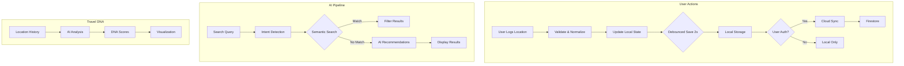

# Wanderlog Workflow Review

## Executive Summary

Wanderlog is a well-architected AI-powered travel journaling platform with a clean separation of concerns. The application demonstrates solid engineering practices including lazy loading, debounced auto-save, and graceful offline fallbacks. However, several workflow inefficiencies and architectural improvements can enhance performance, user experience, and maintainability.

---

## 1. Current Architecture Overview

### 1.1 Data Flow Diagram



### 1.2 Component Hierarchy

```
App.tsx (Main Container)
├── Header
│   ├── OmniBox (Unified Search/Log/Ask)
│   └── Navigation
├── Suspense Boundary
│   ├── LocationForm
│   ├── Dashboard (Stats + DNA)
│   ├── Recommendations (AI Suggestions)
│   ├── TravelMuse (Insights)
│   ├── Timeline (Location Details)
│   ├── SquadHub (Group Trips)
│   ├── BucketList
│   ├── Profile
│   ├── AskJules (Chat)
│   ├── AchievementBadges
│   └── MapModal
└── Toast Notifications
```

---

## 2. Identified Workflow Issues

### 2.1 Performance Issues

| Issue | Location | Impact | Severity |
|-------|----------|--------|----------|
| **Large bundle size** | All lazy components | Slow initial load | Medium |
| **No virtualization** | `unifiedSearchResults` mapping | Slow with 100+ locations | Medium |
| **Redundant DNA generation** | [`Dashboard.tsx:465`](components/Dashboard.tsx:465) | AI calls on every render | High |
| **No pagination** | Location lists | Memory bloat over time | Medium |
| **Geolocation timeout** | [`Recommendations.tsx:39`](components/Recommendations.tsx:39) | 5s blocking call | Low |

### 2.2 Data Management Issues

| Issue | Location | Impact | Severity |
|-------|----------|--------|----------|
| **Dual storage writes** | [`storageService.ts:51`](services/storageService.ts:51) | Redundant writes | Medium |
| **No optimistic updates** | `saveToCloud` | UI lag during sync | Medium |
| **No offline queue** | Cloud sync | Data loss offline | High |
| **Schema migration gaps** | [`App.tsx:223-226`](App.tsx:223-226) | Missing defaults | Low |

### 2.3 UX Workflow Issues

| Issue | Location | Impact | Severity |
|-------|----------|--------|----------|
| **No undo for deletions** | [`handleDeleteLocation`](App.tsx:303-308) | Permanent loss risk | Medium |
| **Form resets on cancel** | [`LocationForm`](components/LocationForm.tsx:133-139) | Lost input data | Low |
| **No autosave for drafts** | LocationForm | Work loss | Medium |
| **No batch operations** | Multiple locations | Time-consuming | Low |

### 2.4 AI Service Issues

| Issue | Location | Impact | Severity |
|-------|----------|--------|----------|
| **No caching layer** | All AI calls | API costs, latency | High |
| **Missing request debouncing** | Semantic search | Race conditions | Medium |
| **No retry logic** | All AI functions | Fragile UX | Medium |
| **Large context windows** | askJules history | Token waste | Low |

---

## 3. Detailed Recommendations

### 3.1 Performance Optimizations

#### 3.1.1 Implement Virtual Scrolling

**Current:** All locations rendered in grid
**Recommended:** Use `react-window` or `react-virtual` for lists >50 items

```typescript
// Example: VirtualGrid.tsx
import { FixedSizeGrid as Grid } from 'react-window';

const VirtualLocationGrid: React.FC<{ items: TravelLocation[] }> = ({ items }) => (
  <AutoSizer>
    {({ height, width }) => (
      <Grid
        columnCount={3}
        columnWidth={width / 3}
        height={height}
        rowCount={Math.ceil(items.length / 3)}
        rowHeight={300}
        itemData={{ items }}
      >
        {({ columnIndex, rowIndex, style, data }) => (
          <LocationCard item={data.items[rowIndex * 3 + columnIndex]} style={style} />
        )}
      </Grid>
    )}
  </AutoSizer>
);
```

#### 3.1.2 Memoize DNA Generation

**Current:** [`generateTravelDNA`](App.tsx:465) called on every render
**Recommended:** Memoize and cache with expiration

```typescript
// In App.tsx - add memoization
const dna = useMemo(() => {
  if (profile.dna) return profile.dna;
  if (locations.length === 0) return null;
  return generateTravelDNA(locations, profile);
}, [locations, profile.dna]);

// Add DNA caching to storage service
const DNA_CACHE_KEY = 'wanderlog_dna_cache';
const DNA_CACHE_DURATION = 24 * 60 * 60 * 1000; // 24 hours
```

#### 3.1.3 Optimize Bundle Splitting

**Current:** All 15+ components lazy-loaded individually
**Recommended:** Group related components

```typescript
// Group 1: Core Features
const CoreFeatures = lazy(() => import('./components/Core').then(m => ({ default: m.Core })));
// Group 2: Social Features  
const SocialFeatures = lazy(() => import('./components/Social').then(m => ({ default: m.Social })));
// Group 3: AI Features
const AIFeatures = lazy(() => import('./components/AI').then(m => ({ default: m.AI })));
```

---

### 3.2 Data Management Improvements

#### 3.2.1 Implement Offline Queue

**Current:** No offline persistence beyond localStorage
**Recommended:** IndexedDB + operation queue

```typescript
// services/offlineQueue.ts
interface QueuedOperation {
  id: string;
  type: 'create' | 'update' | 'delete';
  entity: 'location' | 'profile' | 'trip';
  data: any;
  timestamp: number;
}

class OfflineQueue {
  private queue: QueuedOperation[] = [];
  
  async enqueue(op: QueuedOperation) {
    this.queue.push(op);
    await this.persist();
    if (navigator.onLine) await this.process();
  }
  
  async process() {
    while (this.queue.length > 0) {
      const op = this.queue[0];
      try {
        await this.syncOperation(op);
        this.queue.shift();
      } catch (error) {
        await this.exponentialBackoff(op);
      }
    }
  }
}
```

#### 3.2.2 Add Optimistic Updates

**Current:** UI waits for cloud sync
**Recommended:** Immediate local update with background sync

```typescript
// In App.tsx - optimistic update pattern
const handleAddLocation = (newLoc: Omit<TravelLocation, 'id'>) => {
  // 1. Immediate optimistic update
  const location: TravelLocation = { ...newLoc, id: crypto.randomUUID(), isVisited: true };
  setLocations(prev => [location, ...prev]);
  
  // 2. Show toast
  showToast(`${newLoc.name} added! 🎉`, 'success');
  
  // 3. Background sync (handled by useEffect)
};
```

#### 3.2.3 Consolidate Storage Writes

**Current:** Dual writes to localStorage and Firestore
**Recommended:** Single source of truth with cache invalidation

```typescript
// Improved storage service
export const saveToCloud = async (userId: string, data: StorageData): Promise<void> => {
  try {
    const userRef = doc(db, 'users', userId);
    await setDoc(userRef, data, { merge: true });
    // Update local cache only on success
    saveLocalData(data);
  } catch (error) {
    // Queue for retry instead of immediate local fallback
    await offlineQueue.enqueue({ type: 'sync', data });
  }
};
```

---

### 3.3 AI Service Optimizations

#### 3.3.1 Implement AI Response Cache

**Current:** Every search/ recommendation triggers fresh API call
**Recommended:** Semantic cache with TTL

```typescript
// services/aiCache.ts
const AI_CACHE = new Map<string, { result: any; timestamp: number }>();

const getCachedAIResponse = (key: string, ttlMinutes = 60): any | null => {
  const cached = AI_CACHE.get(key);
  if (cached && Date.now() - cached.timestamp < ttlMinutes * 60 * 1000) {
    return cached.result;
  }
  return null;
};

const cacheAIResponse = (key: string, result: any) => {
  AI_CACHE.set(key, { result, timestamp: Date.now() });
};
```

#### 3.3.2 Add Request Debouncing

**Current:** Race conditions possible in rapid searches
**Recommended:** Debounce all AI requests

```typescript
// hooks/useDebouncedAI.ts
export const useDebouncedAI = () => {
  const timeoutRef = useRef<NodeJS.Timeout>();
  
  const debouncedRequest = <T>(
    request: () => Promise<T>,
    delay: number
  ): Promise<T> => {
    return new Promise((resolve, reject) => {
      if (timeoutRef.current) {
        clearTimeout(timeoutRef.current);
      }
      timeoutRef.current = setTimeout(async () => {
        try {
          const result = await request();
          resolve(result);
        } catch (error) {
          reject(error);
        }
      }, delay);
    });
  };
  
  return { debouncedRequest };
};
```

#### 3.3.3 Optimize Context Window

**Current:** Full history sent to AI on every request
**Recommended:** Truncate and prioritize recent/relevant data

```typescript
// Improved context building
const buildContext = (locations: TravelLocation[], profile: UserProfile) => {
  // 1. Take only last 20 locations
  const recentLocations = locations.slice(0, 20);
  
  // 2. Truncate likes/dislikes to top 3 each
  const truncatedLocations = recentLocations.map(loc => ({
    ...loc,
    likes: loc.likes.slice(0, 3),
    dislikes: loc.dislikes.slice(0, 3)
  }));
  
  return {
    locations: truncatedLocations,
    profile: {
      name: profile.name,
      travelStyle: profile.travelStyle,
      bucketList: profile.bucketList.slice(0, 10)
    }
  };
};
```

---

### 3.4 UX Workflow Improvements

#### 3.4.1 Add Undo Functionality

**Current:** Instant deletion with confirmation only
**Recommended:** Toast with undo action

```typescript
const handleDeleteLocation = (id: string) => {
  const location = locations.find(l => l.id === id);
  const previousLocations = [...locations];
  
  // Immediate remove
  setLocations(prev => prev.filter(l => l.id !== id));
  
  // Show undo toast
  showToast(
    `${location?.name} deleted`, 
    'info', 
    {
      action: {
        label: 'UNDO',
        onClick: () => setLocations(previousLocations)
      }
    }
  );
  
  // Actual delete after timeout
  setTimeout(() => {
    // Permanent delete from cloud
    saveToCloud(user.uid, { locations: locations.filter(l => l.id !== id), ... });
  }, 5000);
};
```

#### 3.4.2 Form Auto-Save

**Current:** Form data lost on navigation
**Recommended:** Draft persistence

```typescript
// LocationForm.tsx - add draft saving
useEffect(() => {
  const draftKey = 'location_form_draft';
  const draft = localStorage.getItem(draftKey);
  if (draft) {
    const data = JSON.parse(draft);
    setName(data.name || '');
    setLikes(data.likes || []);
    setDislikes(data.dislikes || []);
    // ... restore other fields
  }
}, []);

useEffect(() => {
  // Save draft on change
  const draft = { name, likes, dislikes, type, rating };
  localStorage.setItem('location_form_draft', JSON.stringify(draft));
}, [name, likes, dislikes, type, rating]);

const handleSubmit = () => {
  // Clear draft on success
  localStorage.removeItem('location_form_draft');
  // ... submit logic
};
```

#### 3.4.3 Progressive Loading States

**Current:** Binary loading (spinner or content)
**Recommended:** Skeleton screens + progressive content

```typescript
// ProgressiveRecommendations.tsx
const ProgressiveRecommendations: React.FC = () => {
  const [stage, setStage] = useState<'idle' | 'loading' | 'refining' | 'complete'>('idle');

  return (
    <div>
      {stage === 'idle' && <StartButton onClick={() => setStage('loading')} />}
      
      {stage === 'loading' && (
        <div className="space-y-4">
          <Skeleton className="h-32" />
          <div className="flex gap-2">
            <Skeleton className="h-8 w-24" />
            <Skeleton className="h-8 w-24" />
          </div>
        </div>
      )}
      
      {stage === 'refining' && (
        <div className="space-y-4">
          <div className="bg-[#00e054]/10 p-4 rounded">
            <p>Refining based on your vibe...</p>
          </div>
          {/* Show partial results */}
        </div>
      )}
      
      {stage === 'complete' && <ResultsList />}
    </div>
  );
};
```

---

### 3.5 Error Handling Improvements

#### 3.5.1 Implement Error Boundaries

**Current:** Basic try/catch per function
**Recommended:** React Error Boundary with recovery

```typescript
// components/ErrorBoundary.tsx
export class AIErrorBoundary extends React.Component<{ children: React.ReactNode }> {
  state = { hasError: false, error: null };
  
  static getDerivedStateFromError(error: Error) {
    return { hasError: true, error };
  }
  
  componentDidCatch(error: Error, errorInfo: ErrorInfo) {
    // Log to analytics
    logError('AI Feature', error, errorInfo);
  }
  
  render() {
    if (this.state.hasError) {
      return (
        <div className="p-4 bg-red-950/30 border border-red-900/50 rounded">
          <p>AI service temporarily unavailable</p>
          <Button onClick={() => this.setState({ hasError: false })}>
            Retry
          </Button>
        </div>
      );
    }
    return this.props.children;
  }
}
```

#### 3.5.2 Add Retry with Backoff

**Current:** Silent failures with console logs
**Recommended:** Automatic retry with exponential backoff

```typescript
// utils/retry.ts
const retryWithBackoff = async <T>(
  fn: () => Promise<T>,
  maxRetries = 3,
  baseDelay = 1000
): Promise<T> => {
  try {
    return await fn();
  } catch (error) {
    if (maxRetries === 0) throw error;
    const delay = baseDelay * Math.pow(2, 3 - maxRetries);
    await new Promise(resolve => setTimeout(resolve, delay));
    return retryWithBackoff(fn, maxRetries - 1, baseDelay);
  }
};
```

---

## 4. Implementation Priority Matrix

| Priority | Change | Effort | Impact | Files to Modify |
|----------|--------|--------|--------|-----------------|
| **P0** | Offline queue with IndexedDB | Medium | High | `storageService.ts`, `App.tsx` |
| **P0** | DNA memoization | Low | High | `App.tsx`, `Dashboard.tsx` |
| **P1** | AI response caching | Low | High | `geminiService.ts` |
| **P1** | Undo functionality | Medium | High | `App.tsx`, `Toast.tsx` |
| **P1** | Debounced AI requests | Low | Medium | `App.tsx`, `Recommendations.tsx` |
| **P2** | Virtual scrolling | Medium | Medium | Location grid components |
| **P2** | Form draft saving | Low | Medium | `LocationForm.tsx` |
| **P3** | Progressive loading | Medium | Medium | AI components |
| **P3** | Error boundaries | Medium | Low | Wrap AI components |
| **P3** | Bundle optimization | Low | Low | `App.tsx` imports |

---

## 5. Testing Recommendations

### 5.1 Unit Tests Needed
- `storageService` - sync/async operations
- `geminiService` - response parsing
- `App.tsx` - state updates, effects

### 5.2 Integration Tests Needed
- Offline → Online sync flow
- Auth state changes
- AI request debouncing

### 5.3 E2E Tests Needed
- Complete logging workflow
- Search → Recommendation → Save flow
- Squad trip creation

---

## 6. Security Considerations

1. **Environment Variables**: Move all API keys to `.env` (mentioned in README but not implemented)
2. **Firestore Rules**: Validate structure, not just auth
3. **Input Sanitization**: AI responses displayed as-is - potential XSS risk
4. **Image Upload**: No file type validation on photo scanning

---

## 7. Monitoring & Analytics

Add tracking for:
- AI API call frequency/costs
- Offline queue size over time
- Error rates by feature
- User journey funnels
- Performance metrics (Core Web Vitals)

```typescript
// analytics.ts
export const trackEvent = (name: string, params?: Record<string, any>) => {
  // Integrate with analytics provider
  if (typeof window !== 'undefined' && (window as any).gtag) {
    (window as any).gtag('event', name, params);
  }
};
```

---

## 8. Conclusion

Wanderlog demonstrates strong foundational architecture with clear separation of concerns and good use of React patterns. The highest-impact improvements are:

1. **Offline-first architecture** - Critical for reliability
2. **AI response caching** - Reduces costs and latency
3. **Memoization** - Prevents redundant computation
4. **Undo functionality** - Improves UX and reduces data loss

These changes can be implemented incrementally without major refactoring.
